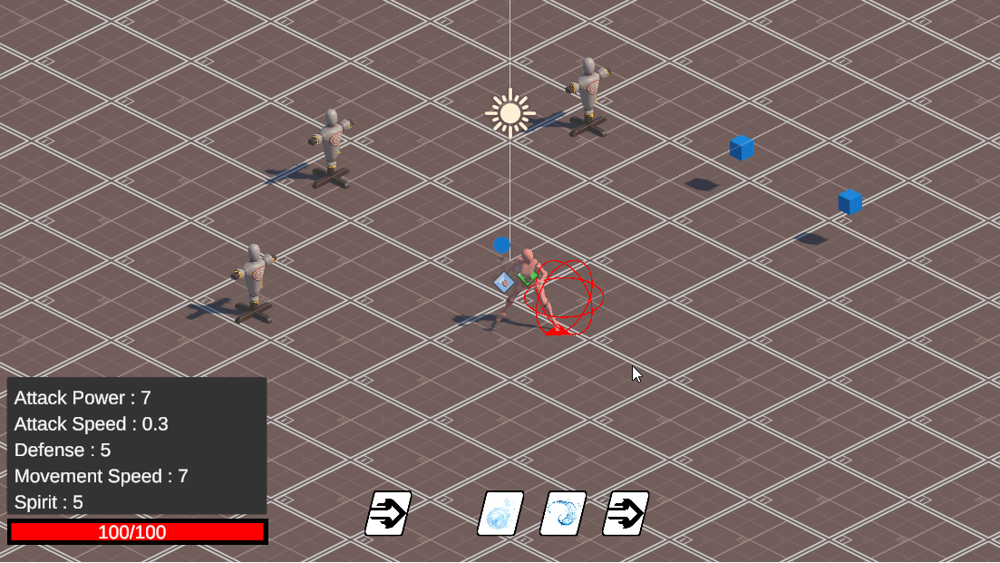
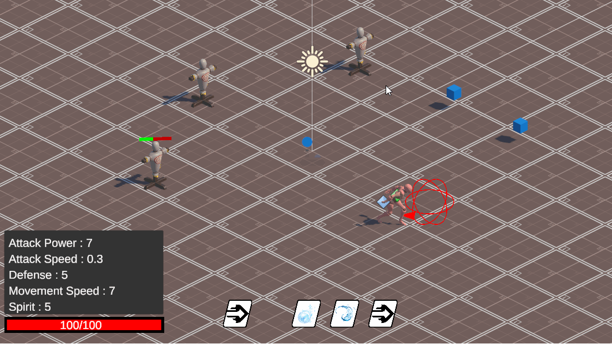
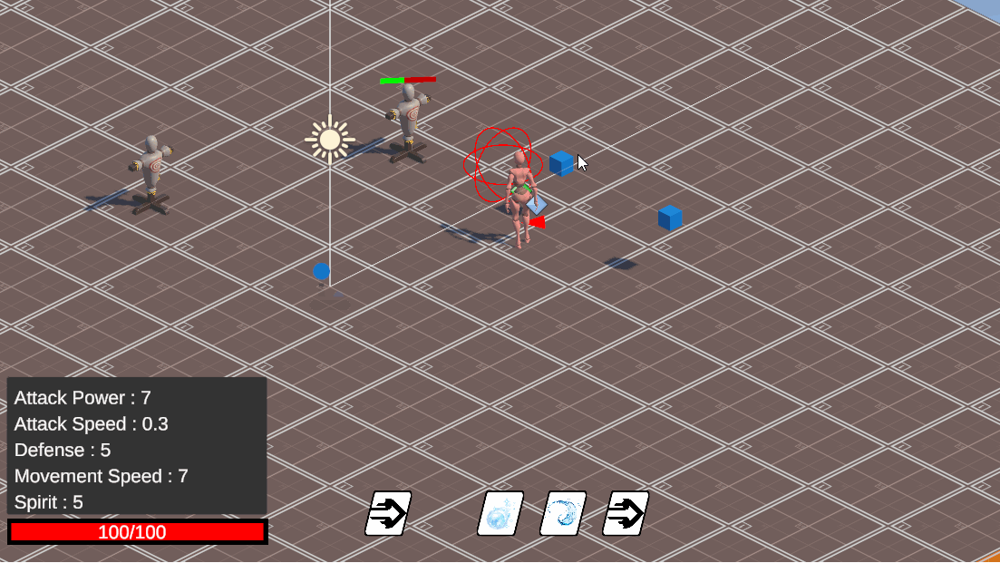
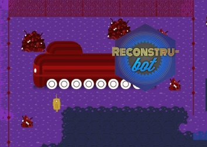
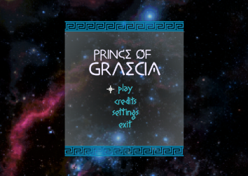


## Latest Personal Projects


---

## Project Avatar


  
  
  
  

\

 Unity 
 C# 


Repository



This project started as a personal challenge to create deep systems and create a game with a bigger scope. 
The game is a _3D Top Down RPG_ made in _Unity_.
**Still work in progress.**  

**Systems**:
- Combat System
- Combo system for combat
- Abilities system
- 3D Controller
- Stats system
- IA working with Utility AI

---

## Hades


 Engines 
 Rust 
 Vulkan 
 OpenGL 


Repository



_Rust_ based _Game Engine_. This project is my way to try to elevate my knowledge about making games. I wanted to try and make a game engine
to understand better how everything works under the hood and also took the oportunity to learn a new programming language
in the process. The aim is to use _Vulkan_ at the end, but in the meantime the engine is using _OpenGL_.  
**Still work in progress.**  
_Dependencies_: Winit, Glow, ImGui, Vulkan/OpenGL.

---


## Jams Participation


---

## Recontru-Bot 


 Unity 
 C# 


Repository


GGJ



Game made for the Caracas Game Jam 2020. An art deco adventure of a robot that wants to repair the world and follow his dreams.

---

## Prince of Graecia 


 Unity 
 C# 


Repository


GGJ



Game made for the Caracas Game Jam 2021. The God Apollo has taken away Orion's powers, darkening the stars of his constellation. Now Orion has to defeat the servants of Apollo to return the light to his stars and regain his powers. (Not a bootleg)

---


## Other Projects


---

## Eumaclang 


 C++ 
 Flex 
 Bison 


Repository



General-purposed programming language developed in the courses _CI4721 - Programming Languages II_ 
and _CI4722 - Programming Languages III_ in the terms April-July 2021 and September-December 2021.

## Tac To Mips 


 C++ 
 MIPS 


Repository



Translator from Three Address Code to MIPS Architecture (specifically to MARS).

## Backoffice


 Django 
 Python 
 HTML 
 CSS 


Repository



Web application for the management of hours and tasks worked by human talent within a company.