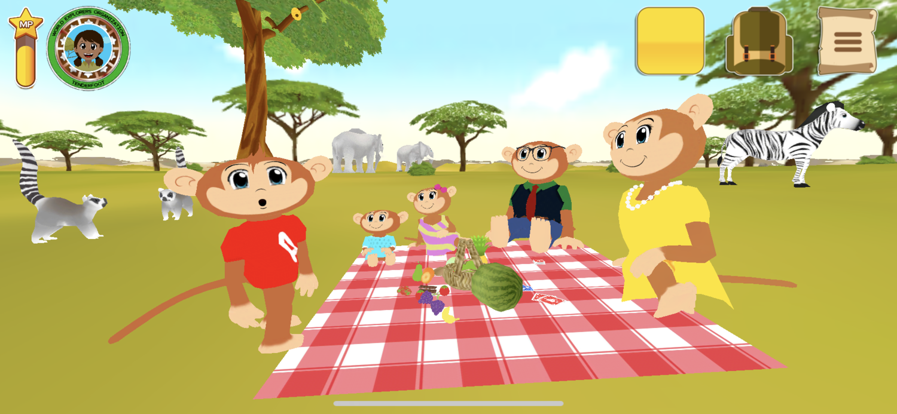
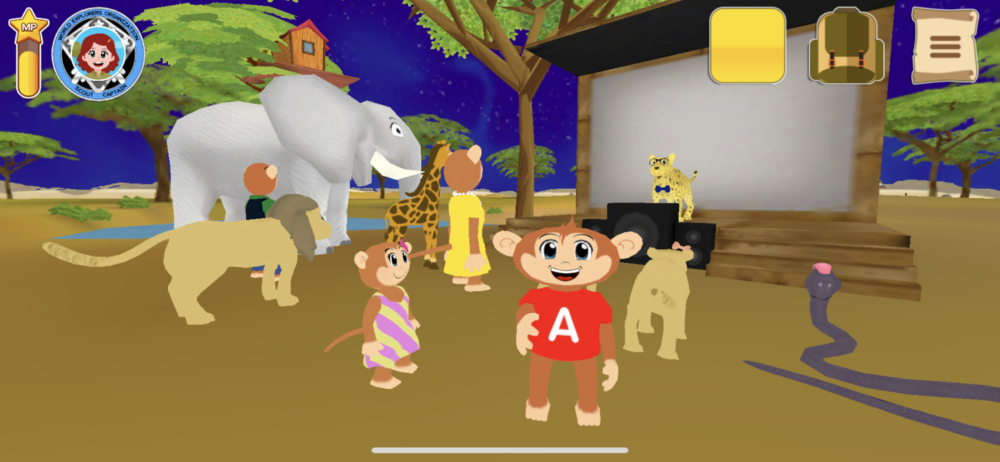
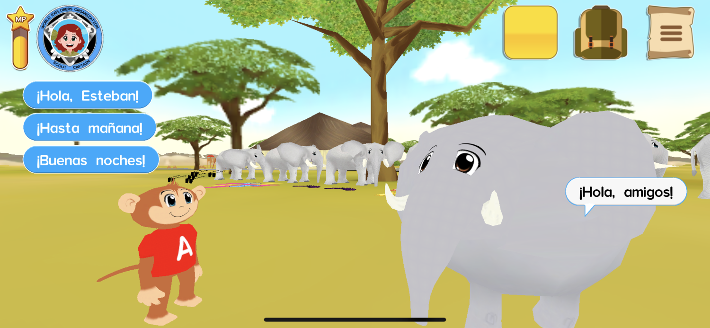

# Learn Safari 


 Unity 
 C# 
 iOS 
 Android 


Website



Developing mobile apps to help kids learn a new language. The apps consist of a series
of lessons, divided by levels, with a story and educational minigames. The apps are: _Spanish Safari_,
for kids to learn Spanish, and _Safari Ingles_, for kids to learn English. Platforms: _iOS_, _Android_ and _Web_.

- **Position:** _Full Stack Developer_
- **Employment type:** _Full-time Remote_
- **Dates:** _2019-Currently_
- **Responsabilities:**
    - Game design of the minigames in the lessons.
    - Development and maintenance of backend systems, such as download system and loading system.
    - Editor tools development for general purpose.
    - Design and development of new features, such as the Dojo.
    - Server/Database maintenance.
    - Design and development of an automation pipeline.


  
  
  
  


---

# Simon Bolivar University  


 Python 


Instructor of the course _Laboratory of Algorithms and Structures I_.
Teaching new students of career _Computer Engineering_ the basic theory of programming and an introduction
to their first programming language. The language chosen was _Python_.

- **Position:** _Instructor_
- **Employment type:** _Part-time_
- **Dates:** _Jan 2018-Apr-2018_
- **Responsabilities:**
    - Prepare the material taught in class.
    - Grade the activities and projects done during the course.