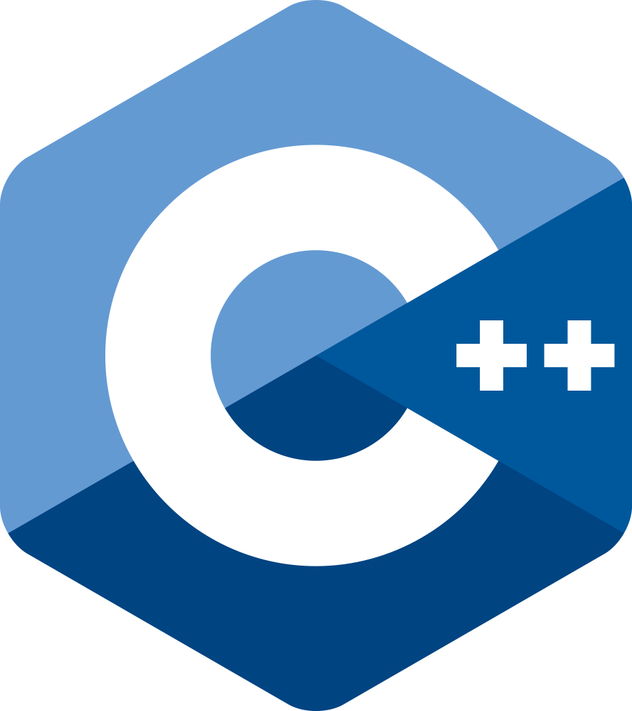
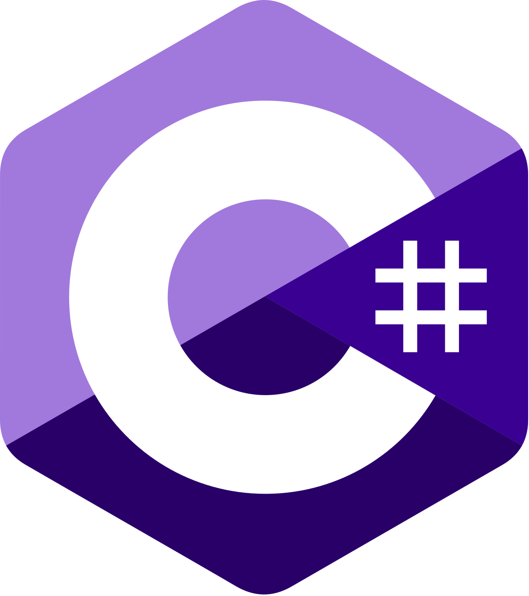
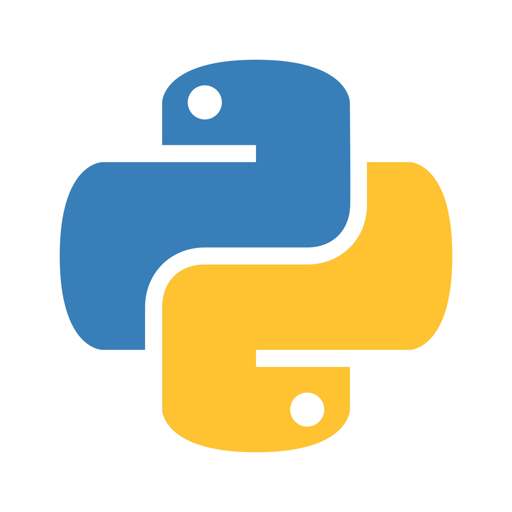
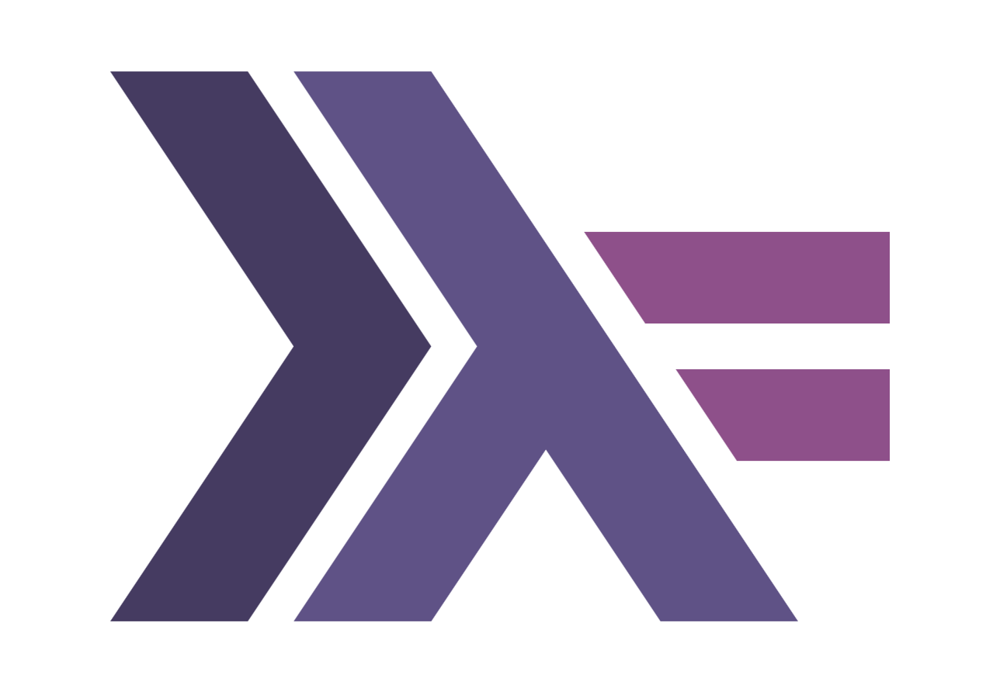
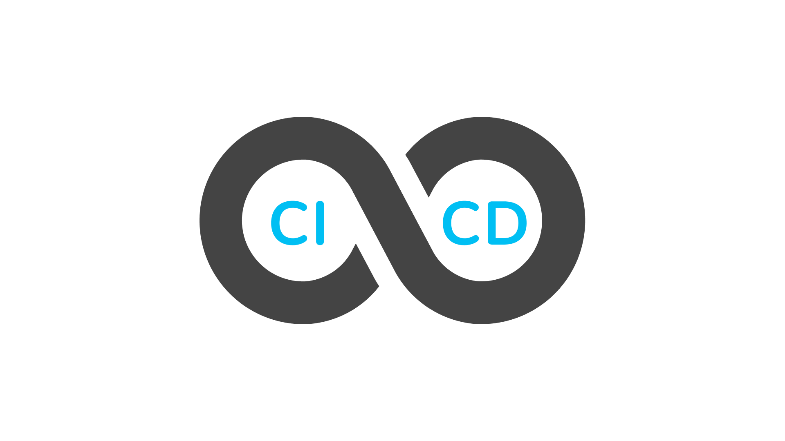

# Game Engines


  <figure>
    
    <figcaption><b>Level: High</b></figcaption>
  </figure>
  <figure>
    
    <figcaption><b>Level: Low/Intermediate</b></figcaption>
  </figure>


---

# Programming Languages


  
  
  
  
  


## Extras


  
  
  
  
  


---

# Tools / Platforms


  
  
  
  
